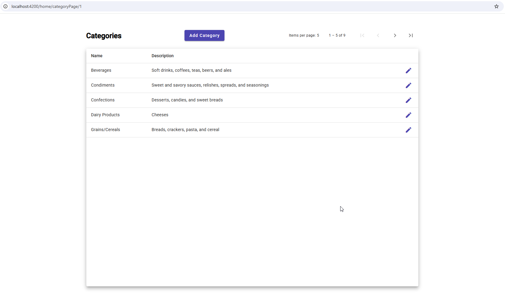
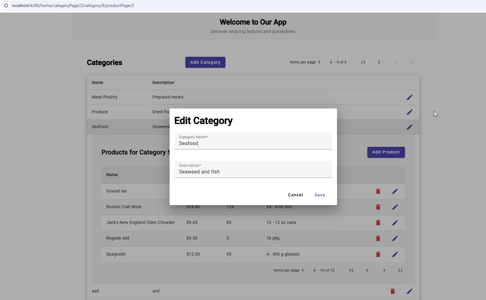
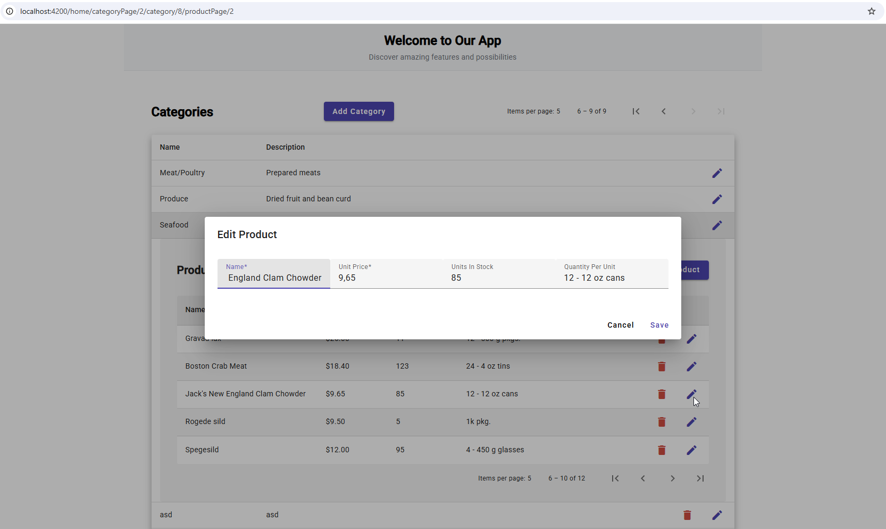
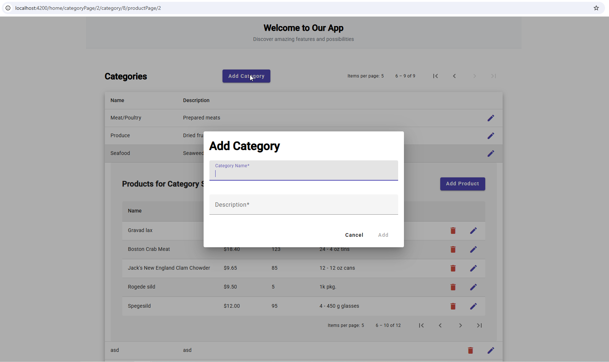

# 🚀 DAB Base Angular Demo

A comprehensive Angular demonstration application showcasing best practices for building modern web applications with complex data interactions. This project serves as a reference implementation for handling nested CRUD operations, pagination, routing, and API integration in Angular.

## 🔗 Backend Integration

This frontend application is designed to work with [DabRestGraphQLBaseDemo](https://github.com/vvidov/DabRestGraphQLBaseDemo) as its backend API. The backend provides:
- RESTful API endpoints
- GraphQL interface
- Nested data relationships
- Pagination support
- Advanced filtering capabilities

## 🎯 Project Purpose

This is not just another e-commerce application - it's a comprehensive demonstration of:
- Handling nested CRUD operations with parent-child relationships
- Implementing server-side pagination and client-side caching
- Managing complex routing scenarios
- Demonstrating best practices for API integration
- Showcasing form handling and validation
- Implementing material design patterns

## 📸 Screenshots

Here's a visual tour of the key features and interfaces:

### Home Dashboard

*The main dashboard with Material Design interface*

### Category Management

*Category listing with pagination and expandable rows*

### Product Management

*Product management interface with parent-child relationship*

### Edit Dialog

*Material Design dialog for editing entities*

## 🚀 Features

- 📱 Responsive Material Design UI
- 🔄 Basic CRUD Operations
  - Category management
  - Product management
  - Parent-child relationships
- 📊 Data Management
  - Simple pagination
  - Expandable rows
  - Nested data views
- 🛣️ Angular Routing
- 📝 Material Design Forms
- 🎨 Material Design Components

## 🛠️ Tech Stack

-  Angular 17.3.0
-  Angular Material 17.3.10
-  TypeScript 5.4.2
-  RxJS 7.8.0

## 📁 Project Structure

```
src/app/
├── category/           # Category management components
├── components/         # Shared components
├── confirm-dialog/    # Confirmation dialog component
├── edit-dialogs/      # Edit dialogs for products and categories
├── home/              # Home page components
├── models/            # Data models and interfaces
├── product/           # Product management components
└── services/          # Application services
```

## 🚦 Getting Started

1. **Prerequisites**
   - Node.js (Latest LTS version)
   - npm package manager

2. **Installation**
   ```bash
   cd my-angular-app
   npm install
   ```

3. **Development Server**
   ```bash
   ng serve
   ```
   Navigate to `http://localhost:4200/`

4. **Build**
   ```bash
   ng build
   ```
   Build artifacts will be stored in the `dist/` directory.

## 🧪 Testing

- **Unit Tests**
  ```bash
  ng test
  ```
  Executes unit tests via [Karma](https://karma-runner.github.io)

## 📚 Key Components

- **Category Component**: Manages product categories with CRUD operations
- **Product Component**: Handles product listings and management
- **Home Component**: Features a dynamic homepage with header and content sections
- **Dialog Components**: Provides interactive edit and confirmation dialogs

## 🔧 Configuration

The application uses Angular's built-in dependency injection system and is configured via:
- `app.config.ts` - Application configuration
- `app.routes.ts` - Route definitions
- `angular.json` - Angular workspace configuration

## 📝 Additional Notes

- The application follows Angular best practices and coding standards
- Uses Angular Material for consistent UI/UX
- Implements responsive design principles
- Features modular architecture for scalability

## 🤝 Contributing

1. Fork the repository
2. Create a feature branch
3. Commit your changes
4. Push to the branch
5. Open a Pull Request

## 📄 License

This project is licensed under the MIT License.

---
For more help on Angular CLI, use `ng help` or check out the [Angular CLI Overview and Command Reference](https://angular.io/cli).
